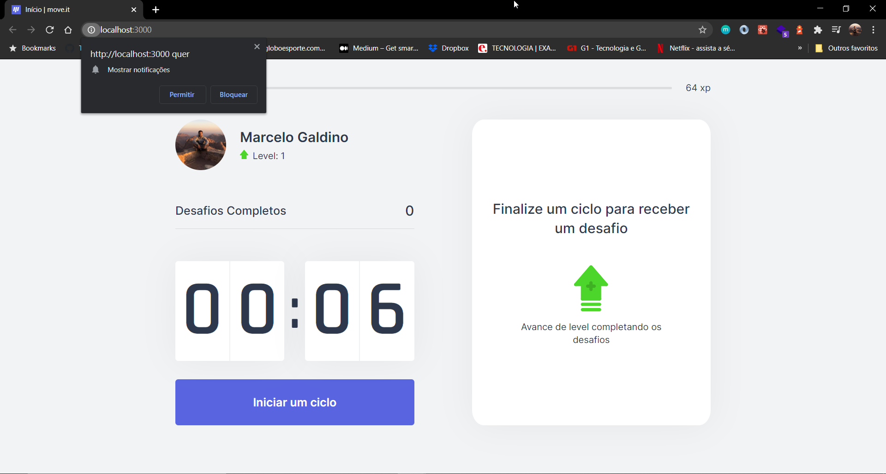
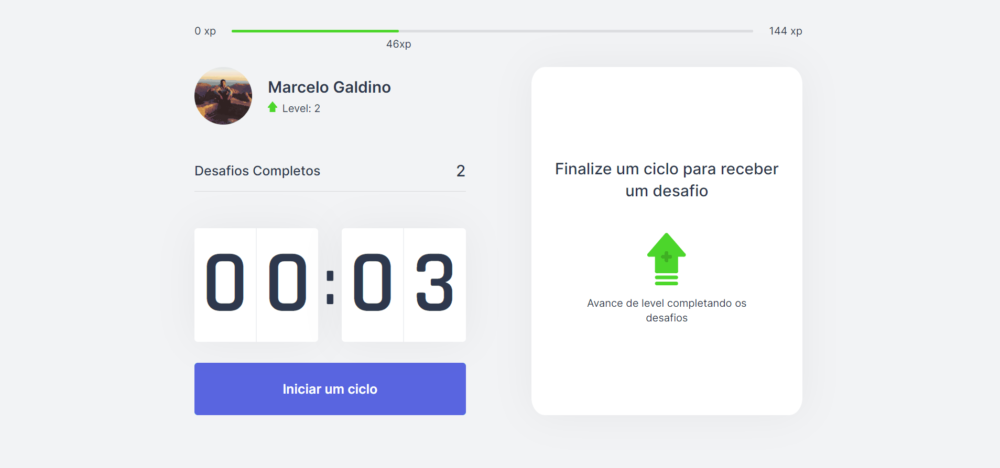

# Mind Your Body
Keep your mind and your body health while working from home!

<h1 align="center">
    
</h1>
 
</h4>
<p align="center">
  

  
	
  <a href="https://www.linkedin.com/in/marcelogaldino/">
    
  </a>

  <a href="https://github.com/marcelogaldino/mindyourbody/commits/master">
    
  </a>

  
   <a href="https://github.com/marcelogaldino/mindyourbody/stargazers">
    
  </a>
</p>

<p align="center">
  <a href="#project">Project</a>&nbsp;&nbsp;&nbsp;|&nbsp;&nbsp;&nbsp;
  <a href="#rocket-Technologies">Technologies</a>&nbsp;&nbsp;&nbsp;|&nbsp;&nbsp;&nbsp;
  <a href="#how-to-use">How to use</a>&nbsp;&nbsp;&nbsp;|&nbsp;&nbsp;&nbsp;
  <a href="#-how-to-contribute">How to contribute</a>&nbsp;&nbsp;&nbsp;|&nbsp;&nbsp;&nbsp;
  <a href="#memo-license">License</a>
</p>

## Project

Mind Your Body is a project that matters with you, with your helath. Keep your mind and body ready to the next level with Mind Your Body.

<h1 align="center">
    
</h1>
<h1 align="center">
    
</h1>


## :rocket: Technologies

This project was developed with the following technologies:

- [Typescript][typescript]
- [ReactJS][react]
- [NextJS][nextjs]

## How To Use

To clone and run this application, you'll need [Git](https://git-scm.com) *(only when using Git CLI)* and [ReactJS](https://reactjs.org/) installed on your computer.

From your command line:

```bash
# Clone this repository
$ git clone https://github.com/marcelogaldino/moveit
```

## Running the project (NPM)

```bash
# Go into directory web/
$ cd mindyourbody
# Install dependencies
$ npm install
# Run the server
$ npm dev
```

## Running the project (Yarn)

```bash
# Go into directory web/
$ cd mindyourbody
# Install dependencies
$ yarn
# Run the server
$ yarn dev
```

## 🤔 How to contribute

- Make a fork;
- Create a branch with your feature: `git checkout -b my-feature`;
- Commit changes: `git commit -m 'feat: My new feature'`;
- Make a push to your branch: `git push origin my-feature`.

After merging your receipt request to done, you can delete a branch from yours.

You are also free to help this project sending me pull requests and opening issues.

## :memo: License

This project is under the MIT license. See the [LICENSE](https://github.com/marcelogaldino/moveit/blob/master/LICENSE) for details.

Made with ♥ by Marcelo Galdino :wave: [Get in touch!](https://www.linkedin.com/in/marcelogaldino/)

[typescript]: https://www.typescriptlang.org/
[react]: https://reactjs.org/
[nextjs]: https://nextjs.org/
